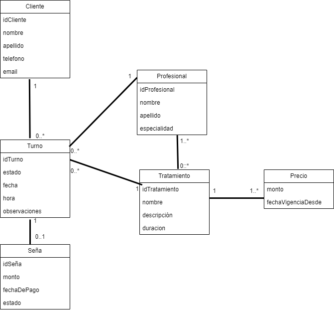

# Propuesta TP DSW

## Grupo

### Integrantes
- 51489 - Giordano Paulina

### Repositorios
- frontend app: https://github.com/TU_USUARIO/centro-estetica-frontend
- backend app: https://github.com/TU_USUARIO/centro-estetica-backend

---

## Tema

### Descripción
Sistema de gestión para un centro de estética que permite administrar clientes, profesionales y tratamientos, así como gestionar la reserva y organización de turnos.

---

## Modelo

---

## Alcance Funcional

### Alcance Mínimo

#### Regularidad

| Req | Detalle |
|:-|:-|
| CRUD simple | 1. CRUD Cliente 2. CRUD Profesional 3. CRUD Tratamiento |
| CRUD dependiente | 1. CRUD Turno {depende de} Cliente, Profesional y Tratamiento |
| Listado + detalle | 1. Listado de tratamientos, muestra nombre, descripción y duración => detalle CRUD Tratamiento 2. Listado de profesionales, muestra nombre, apellido y especialidad => detalle CRUD Profesional 3. Listado de turnos filtrado por fecha o profesional, muestra fecha, hora y estado => detalle muestra todos los atributos del turno y sus relaciones (cliente, profesional y tratamiento) |
| CUU/Epic | 1. Reservar turno para un cliente 2. Confirmar turno mediante pago de seña |

---

### Adicionales para Aprobación

| Req | Detalle |
|:-|:-|
| CRUD | 1. CRUD Cliente 2. CRUD Profesional 3. CRUD Tratamiento 4. CRUD Precio 5. CRUD Turno 6. CRUD Seña |
| CUU/Epic | 1. Reservar turno para un cliente 2. Confirmar turno mediante pago de seña 3. Cancelar turno 4. Reprogramar turno 5. Consultar disponibilidad de un profesional según tratamiento, fecha y horario para la reserva de turnos |
