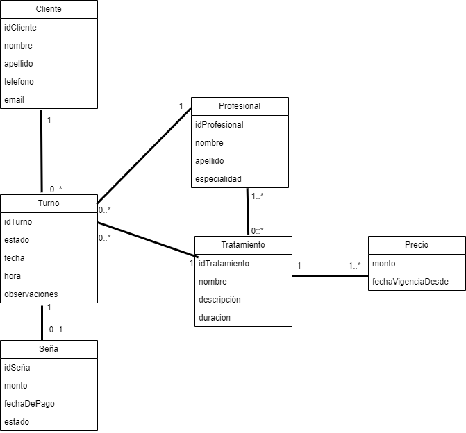

# Propuesta TP DSW

## Grupo

### Integrantes
- 51489 - Giordano Paulina
- 53743 - Farabollini Camila

### Repositorios
- frontend app: https://github.com/PaulinaGiordano/Centro-Estetica-Frontend
- backend app: https://github.com/PaulinaGiordano/Centro-Estetica-Backend

---

## Tema

### Descripción
Sistema de gestión para un centro de estética que permite administrar clientes, profesionales, tratamientos y sus horarios, facilitando la consulta de disponibilidad y la reserva de turnos de forma ágil y organizada.
---

## Modelo

---

## Alcance Funcional

### Alcance Mínimo

#### Regularidad

| Req | Detalle |
| :--- | :--- |
| **CRUD simple** | 1. CRUD Cliente 2. CRUD Tratamiento |
| **CRUD dependiente** | 1. CRUD Turno {depnde de} Cliente, Profesional y Tratamiento |
| **Listado + detalle** | 1. Listado de tratamientos, muestra nombre, descripción y duración => detalle CRUD Tratamiento 2. Listado de profesionales, muestra nombre, apellido y especialidad => detalle CRUD Profesional 3. Listado de turnos filtrado por fecha o profesional, muestra fecha, hora y estado => detalle muestra todos los atributos del turno y sus relaciones (cliente, profesional y tratamiento) |
| **CUU/Epic** | 1. Reservar turno para un cliente |

---

### Adicionales para Aprobación

| Req | Detalle |
| :--- | :--- |
| **CRUD** | 1. CRUD Cliente 2. CRUD Profesional 3. CRUD Tratamiento 4. CRUD Horarios 5. CRUD Turno |
| **CUU/Epic** | 1. Autenticación de usuarios / Login con control de niveles de acceso 2. Consultar disponibilidad de un profesional según tratamiento, fecha y horario para la reserva de turnos 3. Cancelar o reprogramar turno |
